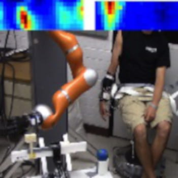
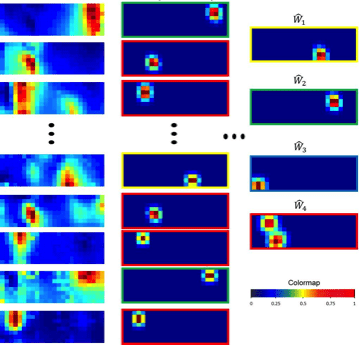

## Project Goal
This project develops advanced neuromuscular control frameworks that decode electromyographic (EMG) signals in real time to achieve intuitive, high-precision control of prosthetic limbs and assistive robotic devices.

---

## Key Contributions
* <strong style="color: #F97316;">High-Density EMG Systems for Multi-DoF Control:</strong> Developed high-density EMG frameworks that enable robust, long-term control of high-degree-of-freedom platforms (such as a 7-DoF robot arm) while enhancing motor skill learning and retention over extended periods.
* <strong style="color: #F97316;">Muscle Synergy-Based Control Architectures:</strong> Leveraged muscle synergy principles to design myoelectric control systems that improve overall performance, skill retainment, and generalization across diverse motor tasks.
* <strong style="color: #F97316;">Simultaneous Multifunction Decoding:</strong> Advanced simultaneous, multi-axis control algorithms to overcome traditional myoelectric limitations and enable seamless, intuitive human-machine interaction in complex scenarios.

---

## Media & Experimental Demos

<!-- 1-Column Media Layout -->

  <!-- YouTube Embed 1 -->
  

    <iframe src="https://www.youtube.com/embed/Z7A3lQWQC2I" style="position: absolute; top:0; left:0; width:100%; height:100%; border:0;" allowfullscreen></iframe>
  

  <!-- YouTube Embed 2 -->
  

    <iframe src="https://www.youtube.com/embed/8gT4alyNW9E" style="position: absolute; top:0; left:0; width:100%; height:100%; border:0;" allowfullscreen></iframe>
  

  <!-- YouTube Embed 3 -->
  

    <iframe src="https://www.youtube.com/embed/W6PznRXhDdw" style="position: absolute; top:0; left:0; width:100%; height:100%; border:0;" allowfullscreen></iframe>
  

<!-- Image Gallery Container -->

  
  

---

## Selected Publications  
(see [Publications](/publication/) for a complete list)

* **High-Density Electromyography and Motor Skill Learning for Robust Long-Term Control of a 7-DoF Robot Arm**  
  Mark Ison, Ivan Vujaklija, Bryan Whitsell, Dario Farina and Panagiotis Artemiadis  
  *IEEE Transactions on Neural Systems & Rehabilitation Engineering*, vol. 24(4), pp. 424-433, 2016. 
  [[PDF](/papers/ison2016highdensity.pdf)]

* **Proportional Myoelectric Control of Robots: Muscle Synergy Development drives Performance Enhancement, Retainment, and Generalization**  
  Mark Ison and Panagiotis Artemiadis  
  *IEEE Transactions on Robotics*, vol. 31, issue 2, pp. 259-268, 2015.
  [[PDF](/papers/ison2015proportional.pdf)]

* **The Role of Muscle Synergies in Myoelectric Control: Trends and Challenges for Simultaneous Multifunction Control**  
  Mark Ison and Panagiotis Artemiadis  
 *Journal of Neural Engineering*, vol. 11(5), 2014.
  [[PDF](/papers/ison2014role.pdf)]

---

