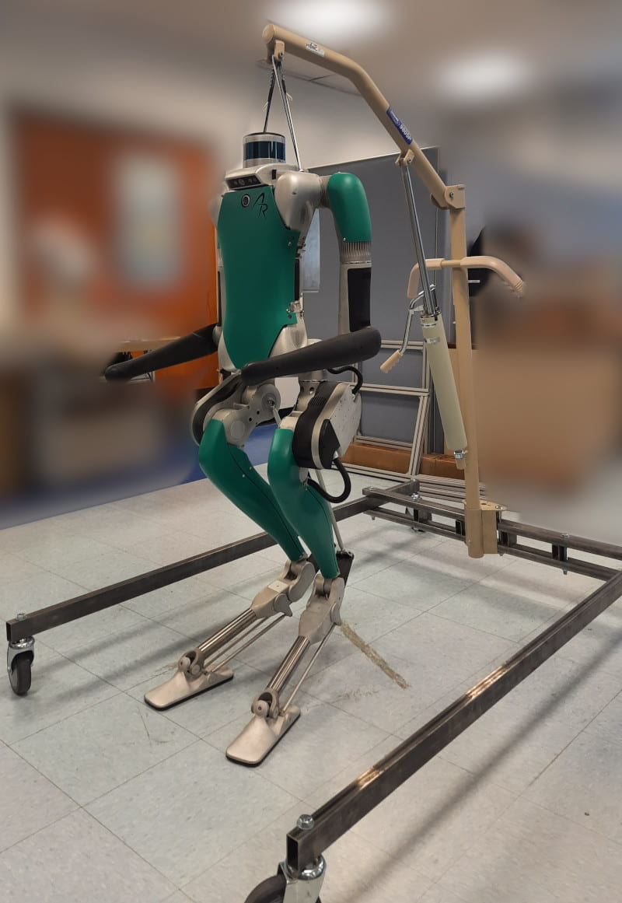
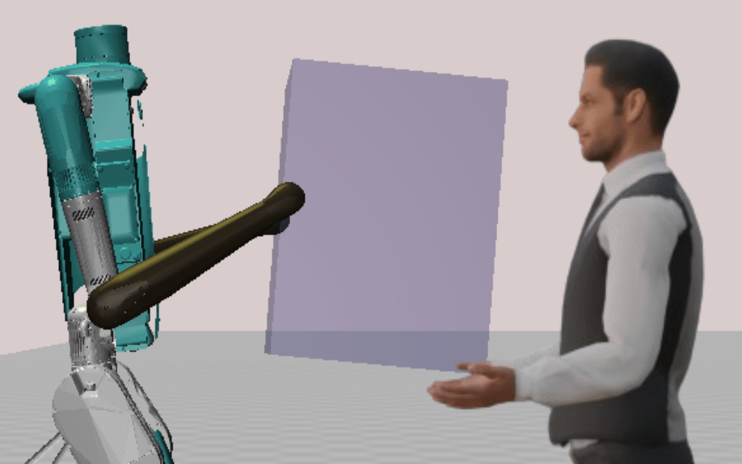

## Project Goal
This project develops advanced control frameworks for humanoid robots that enable safe, compliant, and intuitive physical collaboration with humans during shared tasks such as joint object transportation and manipulation.

---

## Key Contributions
* <strong style="color: #F97316;">Hybrid MPC & Admittance Control Framework:</strong> Integrated Model Predictive Control with an admittance control model to dynamically adapt bipedal behavior in response to real-time interaction forces..
* <strong style="color: #F97316;">Novel I-LIP Modeling:</strong> Formulated the Interaction Linear Inverted Pendulum (I-LIP) model to generate adaptive footstep patterns for physical co-manipulation tasks.
* <strong style="color: #F97316;">Coupled Stability and Compliance:</strong> Achieved simultaneous bipedal balance and compliant behavior during physical human-robot collaboration..

---

## Media & Experimental Demos

<!-- 1-Column Media Layout -->

  <!-- YouTube Embed 1 -->
  

    <iframe src="https://www.youtube.com/embed/IWNRkgJ09hc" style="position: absolute; top:0; left:0; width:100%; height:100%; border:0;" allowfullscreen></iframe>
  

<!-- Image Gallery Container -->

  
  

---

## Selected Publications  
(see [Publications](/publication/) for a complete list)

* **MPC-QP-based Control Framework for Compliant Behavior of Humanoid Robots in Physical Collaboration with Humans**  
  Shubham Kumbhar and Panagiotis Artemiadis  
  *IEEE International Conference on Robotics and Automation (ICRA)*, Atlanta, GA, 2025  
  [[PDF](/papers/kumbhar2025mpcqp.pdf)]

* **Toward Seamless Physical Human-Humanoid Interaction: Insights from Control, Intent, and Modeling with a Vision for What Comes Next**  
  Gustavo A. Cardona, Shubham S. Kumbhar, and Panagiotis Artemiadis  
  *Journal of Intelligent & Robotic Systems*, 2026, 
  [[PDF](/papers/cardona2026toward.pdf)]

---

## Funding & Acknowledgments
This work has been supported by the following grants:
* **NSF:** 2020009, 2015786, 2025797, 201890, 2415093
* **NIH:** NIH 1R01HD111071-01
* Any opinions, findings, and conclusions expressed are those of the authors.