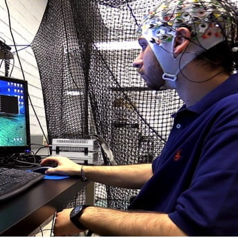
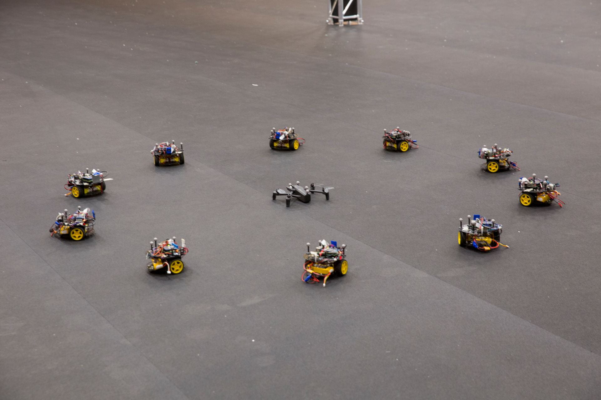

## Project Goal
This project advances human-multi-agent interaction by creating intuitive, responsive control frameworks at the intersection of neuroscience, robotics, and machine learning. We integrate physiological intent decoding with distributed control to build scalable, low-cognitive-load interfaces for supervising complex multi-agent systems. Additionally, we apply adversarial machine learning using probing agents to actively discover and identify leader agents within dynamic multi-agent topologies.

---

## Key Contributions
* <strong style="color: #F97316;">EEG-Based Trust Quantification:</strong> Utilized electroencephalography (EEG) signals to decode, quantify, and model real-time human trust levels during human-multi-agent interaction.
* <strong style="color: #F97316;">Brain-Machine Interface (BMI) Control:</strong> Formulated novel control methodologies leveraging brain-machine interfaces (BMI) for intuitive, direct human supervision of multi-agent systems.
* <strong style="color: #F97316;">Adversarial Leader Identification:</strong> Developed the first learning-based framework for automatic leader identification, using deep reinforcement learning to train a physically interactive probing agent within partially observable multi-agent environments.

---

## Media & Experimental Demos

<!-- 1-Column Media Layout -->

  <!-- YouTube Embed 1 -->
  

    <iframe src="https://www.youtube.com/embed/BymnXeuSLcY" style="position: absolute; top:0; left:0; width:100%; height:100%; border:0;" allowfullscreen></iframe>
  

  <!-- YouTube Embed 2 -->
  

    <iframe src="https://www.youtube.com/embed/m6Jcf1Zr560" style="position: absolute; top:0; left:0; width:100%; height:100%; border:0;" allowfullscreen></iframe>
  

<!-- Image Gallery Container -->

  
  

---

## Selected Publications  
(see [Publications](/publication/) for a complete list)

* **Extracting Human Levels of Trust in Human-Swarm Interaction using EEG signals**  
  Jesus Orozco and Panagiotis Artemiadis  
  *IEEE Transactions on Human-Machine Systems*, vol. 54, no. 2, pp. 182–191, April 2024.  
  [[PDF](/papers/THMS_Orozco24)]

* **Inferring imagined speech using EEG signals: a new approach using Riemannian manifold features**  
  Chuong H. Nguyen, George K. Karavas, and Panagiotis Artemiadis  
  *Journal of Neural Engineering*, vol. 15, no. 1, 016002, 2018.  
  [[PDF](/papers/JNE18_Nguyen.pdf)] [[EEG Dataset](https://www.dropbox.com/s/01k9c75j0x3jfb9/dataset.zip?dl=0)]

* **Learning Adversarial Policies for Swarm Leader Identification using a Probing Agent**  
  Stergios Bachoumas and Panagiotis Artemiadis  
  *IEEE International Conference on Robotics and Automation (ICRA)*, Atlanta, GA, 2025.  
  [[PDF](/papers/ICRA25_Bachoumas.pdf)]

---

## Funding & Acknowledgments
This work has been supported by the following grants:
* **DARPA:** D14AP00068
* **AFOSR:** FA9550-14-1-0149, FA9550-18-1-0221, FA9550-18-1-0464
* **NSF:** 2014264
* Any opinions, findings, and conclusions expressed are those of the authors.