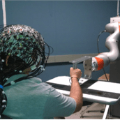
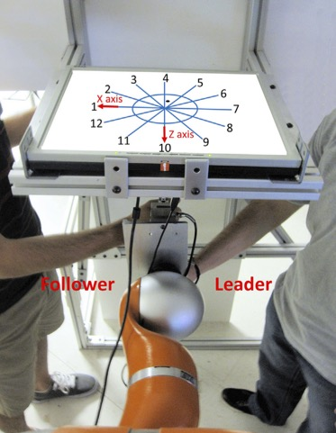

## Project Goal
This project develops advanced human-robot interfaces that integrate neural signals and movement intent inference to enable seamless, intuitive physical collaboration during complex tasks.

---

## Key Contributions
* <strong style="color: #F97316;">Movement Intent Inference Algorithms:</strong> Developed algorithms to infer intended movement directions based on human-human physical interaction paradigms, enabling more intuitive human-robot collaboration.
* <strong style="color: #F97316;">6-DOF Physical Interaction Control:</strong> Formulated control strategies capable of managing complex, full six-degrees-of-freedom (6-DOF) physical interactions during shared tasks.
* <strong style="color: #F97316;">Asymmetric Task Sharing & Role Allocation:</strong> Designed adaptive control frameworks that accommodate varying and unequal task contributions between human and robotic partners.

---

<!-- Image Gallery Container -->

  
  

---

## Selected Publications  
(see [Publications](/publication/) for a complete list)

* **Communication and Inference of Intended Movement Direction during Human-Human Physical Interaction**  
  Keivan Mojtahedi, Bryan Whitsell, Panagiotis Artemiadis and Marco Santello  
  *Frontiers in Neurorobotics*, vol. 11 (21), pp. 1-12, 2017.
  [[PDF](/papers/mojtahedi2017communication.pdf)]

* **Physical Human–Robot Interaction (pHRI) in 6 DOF With Asymmetric Cooperation**  
  Bryan Whitsell and Panagiotis Artemiadis 
  *IEEE Access*, vol. 5, pp. 10834-10845, 2017.
  [[PDF](/papers/whitsell2017physical.pdf)]

* **Effective Neural Representations for Brain-Mediated Human-Robot Interactions**  
  Christopher A. Buneo, Stephen Helms Tillery, Marco Santello, Veronica J. Santos, and Panagiotis Artemiadis
  *In Neuro-robotics: From brain machine interfaces to rehabilitation robotics*, as part of the Springer series on Trends on Augmentation of Human Performance, Artemiadis, P., Ed., New York:Springer, 2014, Vol. 2., pp. 207-237. Springer Netherlands, 2014.

---

