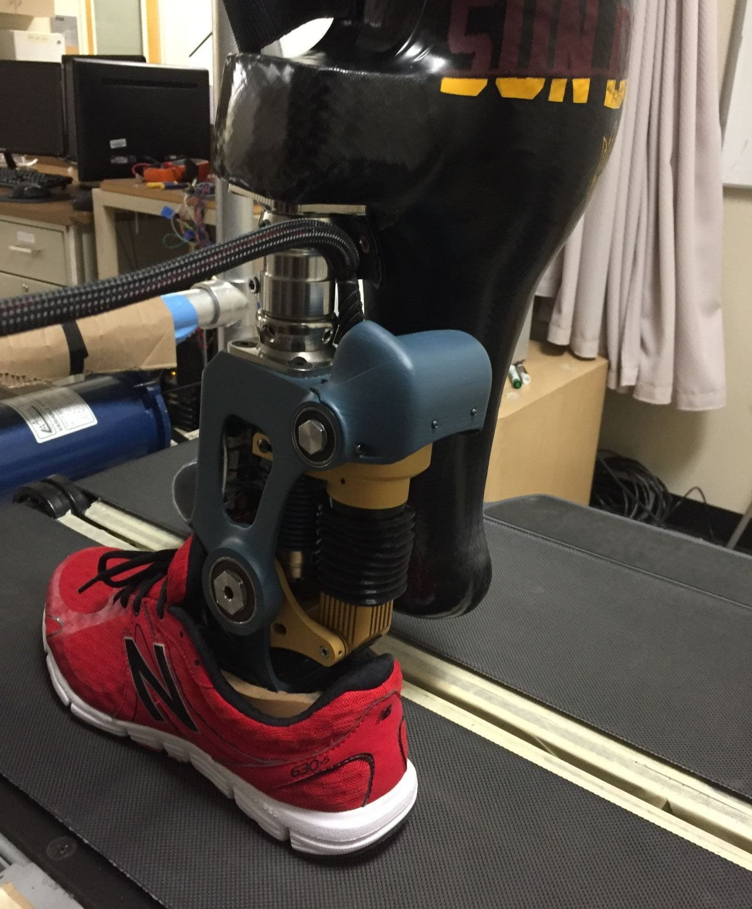
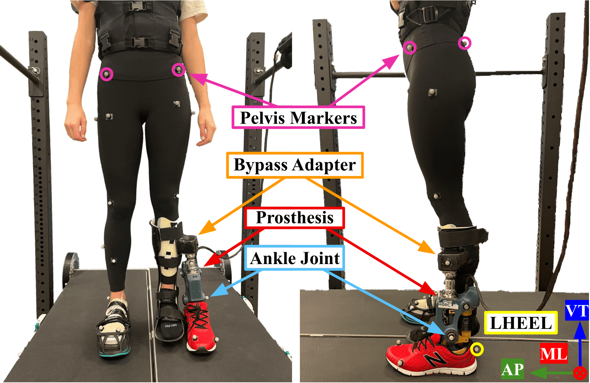

## Project Goal
This project develops human-in-the-loop adaptive control systems for prosthetic devices that enhance user mobility and stability across varied terrains.

---

## Key Contributions
* <strong style="color: #F97316;">Dynamic Adaptive Control Design:</strong> Developed intelligent prosthetic controllers that dynamically adapt parameters in real time to suit changing surface conditions and individual user needs..
* <strong style="color: #F97316;">Predictive Surface Transitioning:</strong> Formulated predictive models using neural and kinematic signals to anticipate transitions to compliant terrains during gait, ensuring smooth, uninterrupted locomotion.
* <strong style="color: #F97316;">Terrain-Adaptive Stiffness Modulation:</strong> Implemented real-time ankle-foot stiffness tuning to enhance user balance, stability, and agility over soft, uneven, or compliant surfaces.

---

## Media & Experimental Demos

<!-- 1-Column Media Layout -->

  <!-- YouTube Embed 1 -->
  

    <iframe src="https://www.youtube.com/embed/sCRr9eyEk_o" style="position: absolute; top:0; left:0; width:100%; height:100%; border:0;" allowfullscreen></iframe>
  

  <!-- YouTube Embed 2 -->
  

    <iframe src="https://www.youtube.com/embed/k4BS8OXOvD0" style="position: absolute; top:0; left:0; width:100%; height:100%; border:0;" allowfullscreen></iframe>
  

<!-- Image Gallery Container -->

  
  

---

## Selected Publications  
(see [Publications](/publication/) for a complete list)

* **On Predicting Transitions to Compliant Surfaces in Human Gait via Neural and Kinematic Signals**  
  Charikleia Angelidou and Panagiotis Artemiadis
  *IEEE Transactions on Neural Systems and Rehabilitation Engineering*, 31:2214-2223, 2023.
  [[PDF](/papers/angelidou2023predicting.pdf)]

* **Adjusting the Quasi-Stiffness of an Ankle-Foot Prosthesis Improves Walking Stability during Locomotion over Compliant Terrain**  
  Chrysostomos Karakasis, Robert Salati and Panagiotis Artemiadis
  *In the Proc. of the 2023 IEEE/RSJ International Conference on Intelligent Robots and Systems (IROS)*, Detroit, MI, USA, pp. 2140-2145, 2023
  [[PDF](/papers/karakasis2023adjusting.pdf)]

* **On the Effects of Visual Anticipation of Floor Compliance Changes on Human Gait: Towards Model-based Robot-Assisted Rehabilitation**  
  Michael Drolet, Emiliano Quinones Yumbla, Bradley Hobbs and Panagiotis Artemiadis  
 *In the Proc. of the 2020 IEEE International Conference on Robotics and Automation (ICRA)*, pp. 9072-9078, 2020.
  [[PDF](/papers/drolet2020effects.pdf)]

---

## Funding & Acknowledgments
This work has been supported by the following grants:
* **NSF:** 2020009, 2015786, 2025797, 201890
* Any opinions, findings, and conclusions expressed are those of the authors.