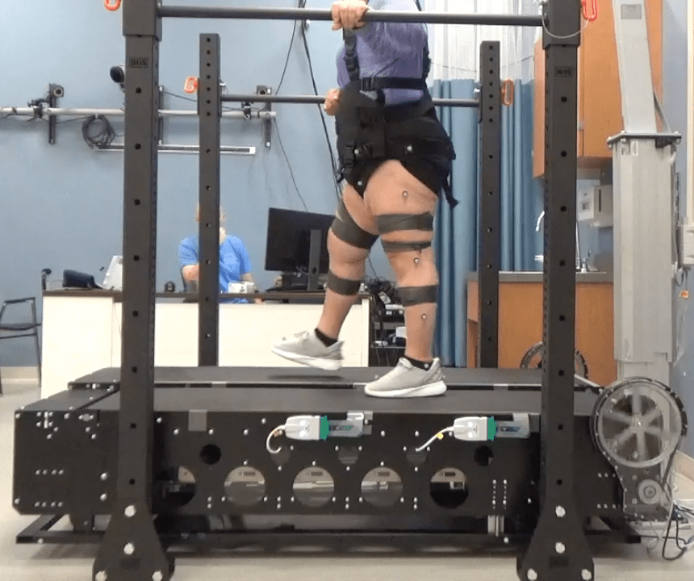
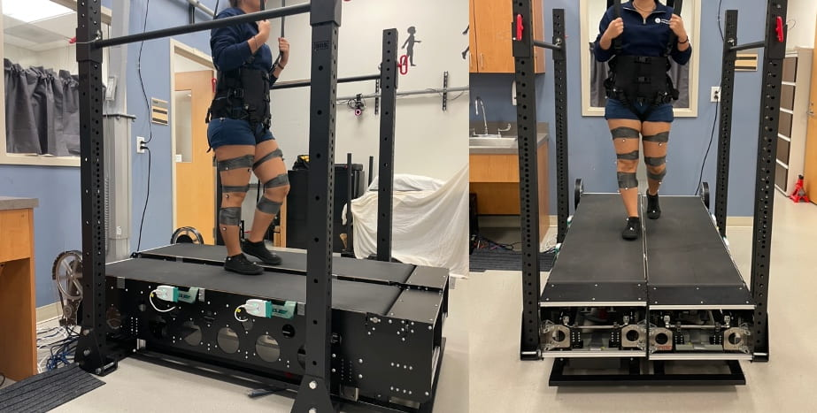

## Project Goal
This project develops a novel post-stroke rehabilitation platform using the Variable Stiffness Treadmill (VST) to deliver targeted unilateral surface perturbations, evoking therapeutic motor responses in the impaired leg to increase step length and reduce drop-foot in mobility impaired.

---

## Key Contributions
* <strong style="color: #F97316;">Demonstration of Lasting Motor Aftereffects:</strong> Proved that robot-assisted surface stiffness perturbations induce persistent sensorimotor adaptations, facilitating neural plasticity and improving inter-leg coordination post-stroke.
* <strong style="color: #F97316;">Patient-Specific Rehabilitation Personalization:</strong> Established a framework for real-time, dynamic stiffness adjustment to tailor mechanical perturbations to an individual’s unique gait deficits and training needs.
* <strong style="color: #F97316;">Mechanistic Insights into Mechanical Interventions:</strong> Advanced fundamental understanding of how targeted physical/mechanical perturbations engage neural pathways to correct post-stroke motor impairments.
* <strong style="color: #F97316;">Translational Clinical Impact:</strong> Demonstrated a viable robotic intervention to improve functional mobility, step symmetry, and gait mechanics for hemiparetic patients.

---

## Media & Experimental Demos

<!-- 1-Column Media Layout -->

  <!-- YouTube Embed 1 -->
  

    <iframe src="https://www.youtube.com/embed/woOYxGF_kWA" style="position: absolute; top:0; left:0; width:100%; height:100%; border:0;" allowfullscreen></iframe>
  

  <!-- YouTube Embed 2 -->
  

    <iframe src="https://www.youtube.com/embed/urGb1AtLhiA" style="position: absolute; top:0; left:0; width:100%; height:100%; border:0;" allowfullscreen></iframe>
  

  <!-- YouTube Embed 3 -->
  

    <iframe src="https://www.youtube.com/embed/VWOBG2rHyA4" style="position: absolute; top:0; left:0; width:100%; height:100%; border:0;" allowfullscreen></iframe>
  

<!-- Image Gallery Container -->

  
  

---

## Selected Publications  
(see [Publications](/publication/) for a complete list)

* **The Variable Stiffness Treadmill (VST) 2: Development and Validation of a Unique Tool to Investigate Locomotion on Compliant Terrain**  
  Vaughn Chambers, Bradley Hobbs, William Gaither, Zachary The, Anthony Zhou, Chrysostomos Karakasis, Panagiotis Artemiadis  
  *J. Mechanisms Robotics*, 2025.  
  [[PDF](/papers/chambers2025variable.pdf)]

* **Using robot-assisted stiffness perturbations to evoke aftereffects useful to post-stroke gait rehabilitation**  
  Vaughn Chambers and Panagiotis Artemiadis  
  *Frontiers in Robotics and AI*, 9, 2023.
  [[PDF](/papers/chambers2023using.pdf)]

* **Variable Stiffness Treadmill (VST): System Development, Characterization and Preliminary Experiments**  
  Jeffrey Skidmore, Andrew Barkan and Panagiotis Artemiadis  
 *IEEE/ASME Transactions on Mechatronics*, vol. 20, issue 4, pp. 1717-1724, 2015.
  [[PDF](/papers/skidmore2015variable.pdf)]

---

## Funding & Acknowledgments
This work has been supported by the following grants:
* **NSF:** 2020009, 2015786, 2025797, 201890, 2415093
* **NIH:** NIH 1R01HD111071-01
* Any opinions, findings, and conclusions expressed are those of the authors.